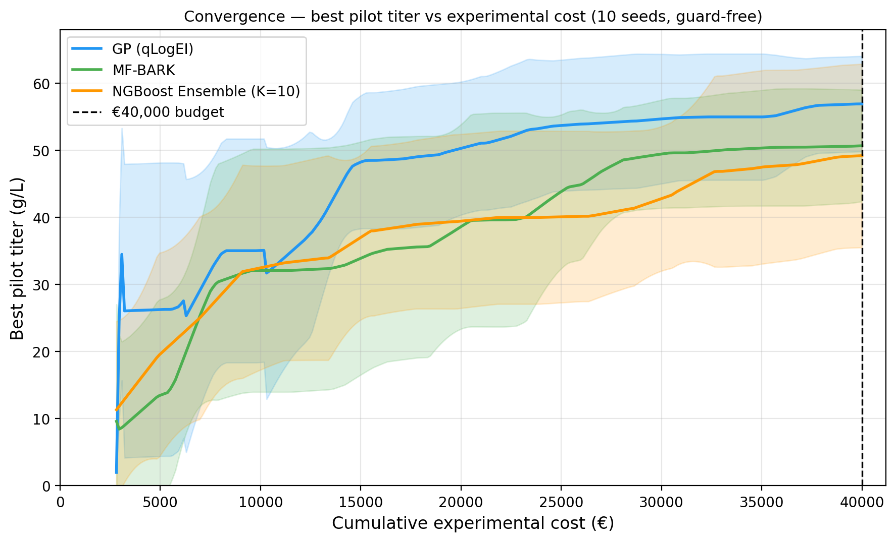
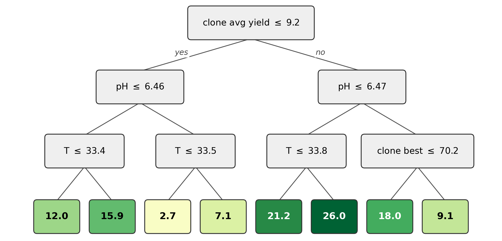

# Tree surrogates for multi-fidelity Bayesian optimisation

Bayesian optimisation for bioprocess development almost always uses a Gaussian process
surrogate, because a GP gives calibrated uncertainty. This project asks whether a tree-based
surrogate can take its place, and what it costs to do so.

Two tree surrogates are built and benchmarked against a GP baseline on a simulated cell
culture, where each experiment can be run at one of three scales of differing cost and
accuracy and also selects one of 30 cell lines, under a fixed €40,000 experimental budget.

<p align="center">
  <a href="https://rchehwan.github.io/mf-tree-bo/">
    
  </a>
</p>

<p align="center"><i>Move the sliders, follow a decision down the tree, see what it predicts.</i></p>



## Results

| Method | Final pilot titer (g/L) | Interpretable |
|---|---|---|
| GP baseline | **56.3 ± 5.6** | no |
| MF-BARK | 51.2 ± 9.7 | no |
| NGBoost ensemble | 49.8 ± 9.1 | **yes** |

Mean ± standard deviation over 10 seeds.

Three findings:

- Both tree methods choose their own fidelities. Their uncertainty grows where data is thin,
  so the acquisition can tell when cheap screening has stopped being informative and the
  expensive pilot scale is worth paying for.
- They are competitive with the GP, though not equal to it. At 10 seeds the gap is about one
  and a half standard errors.
- Interpretability is nearly free. The interpretable ensemble is 1.4 g/L below the black-box
  tree method, which is inside run-to-run noise, and in exchange it produces readable rules.

The ensemble can be distilled into a single tree that reproduces it with an R² of 0.835,
giving a readable account of what drives titer:



## Methods

**GP baseline.** The published multi-fidelity GP engine with qLogEI acquisition, used
unchanged apart from the objective it is pointed at.

**MF-BARK.** A multi-fidelity extension of the BARK tree kernel. Similarity between two
recipes is the fraction of trees that place them in the same leaf, multiplied by two learned
coregionalisation matrices, one over the three scales and one over the 30 clones. The forest
structure and both matrices are sampled by MCMC, so the posterior is an average over many
Gaussian processes and its uncertainty reflects which forest is right.

**NGBoost ensemble.** Ten probabilistic gradient-boosted models trained on different bootstrap
resamples with varied tree depths. Their disagreement supplies the uncertainty the acquisition
needs without forming a kernel, and each member stays a readable tree.

Both tree methods share a Monte-Carlo multi-fidelity Max-value Entropy Search acquisition that
scores each scale by information gained per unit cost, and scores a batch jointly rather than
summing its points.

## Installation

```bash
git clone https://github.com/Rchehwan/mf-tree-bo.git
cd mf-tree-bo
python -m venv .venv && source .venv/bin/activate
pip install -r requirements.txt
```

## What is not included

Two dependencies live outside this repository and are not on PyPI.

**`mfbo4bio`** is the multi-fidelity GP engine used as the baseline, and is the supplementary
code for Martens et al. It is public and MIT licensed:
[adrian-martens/mf-bo4bio](https://github.com/adrian-martens/mf-bo4bio). Clone it and point the
loader at it:

```bash
export MFBO_ROOT=/path/to/mf-bo4bio
```

**`dbiolab`** is an extended version of that simulator, adding the product aggregation term
this project's objective depends on. It is not publicly available and is used here with the
author's permission.

The tree surrogates in `src/` are self-contained and can be read without either. The
experiment scripts need both, so the results in `results/` cannot be regenerated from this
repository alone.

## Reproducing the results

```bash
python experiments/run_gp_baseline.py 10        # GP baseline, 10 seeds
python experiments/run_mfbark.py 10             # MF-BARK
python experiments/run_ngboost_ensemble.py 10   # NGBoost ensemble
python experiments/run_interpretability.py      # importances, distilled tree, rule validation
```

A full 10-seed MF-BARK campaign takes roughly 45 minutes on a laptop. Each run writes a
timestamped summary JSON to `results/`; the four files already there are the runs reported
above, renamed for readability.

## Layout

```
src/           surrogates, acquisition, BO loop, objective wrapper
experiments/   one script per reported experiment
analysis/      rebuilds the convergence data used by the site
results/       summary JSON for each reported run
figures/       the figures reported in the write-up
docs/          the interactive site, published with GitHub Pages
```

Key modules:

| File | Contents |
|---|---|
| `src/mf_bark.py` | MF-BARK: tree-agreement kernel, coregionalisation matrices, MCMC sampler |
| `src/ngboost_ensemble.py` | The NGBoost ensemble surrogate |
| `src/impact_encoding.py` | Leakage-free clone encoding |
| `src/acquisition.py` | Cost-aware multi-fidelity MES |
| `src/bo_loop.py` | The optimisation loop shared by both tree methods |
| `src/objective.py` | Objective, scales, costs and noise |

## Setup

| Scale | Cost | Batch size | Notes |
|---|---|---|---|
| MTP | €10 | 12 | Noisiest; temperature and pH shared across the plate |
| MBR | €575 | 4 | Low noise, behaves close to the pilot |
| Pilot | €2100 | 1 | The target scale |

A recipe is five continuous settings, being temperature, pH and three feed amounts, plus one
of 30 clones. The objective is the peak active product titer at the pilot scale.

## Notes

This code accompanies an MSc research project at Imperial College London. The simulator builds
on the multi-fidelity bioprocess benchmark of Martens et al. (arXiv:2508.10970), and MF-BARK
extends BARK (Boyne et al., arXiv:2503.05574) to multiple fidelities.
